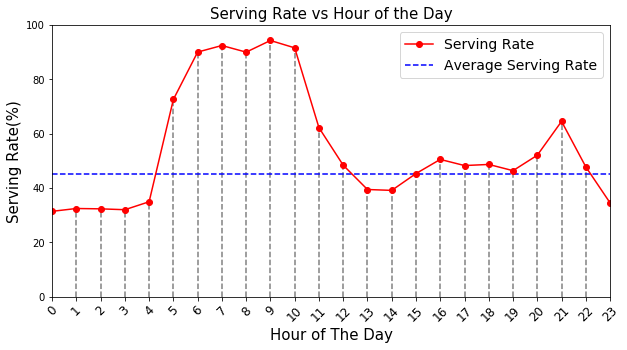
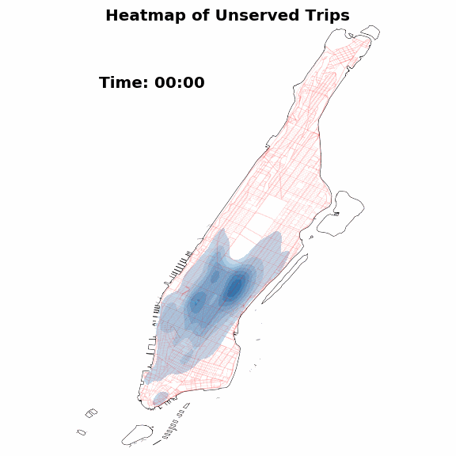

# Data Visualization Final Challenge Submission
### Author: Shivam Kumar Pathak (skp454)

### Q1: What is the serving rate for each scenario throughout the day, comparing to the overall serving rate? Serving rate is the number of successfully matched trip in a period of time. For example, is the serving rate higher in the rush hour or at night?

### Answer:

### Q2: For those trips that could not be served, do they follow a spatial or temporal pattern? For example, are most of those trips originated in particular regions, and of certain times?

### Answer:

### Q5: What can we learn about the vehicle utilization? Are most of them empty, or with 1, 2, 3 or 4 passengers? Are there particular vehicles that tend to ride with more passengers than others? If so, how are they distributed in space and time.

### Answer:
