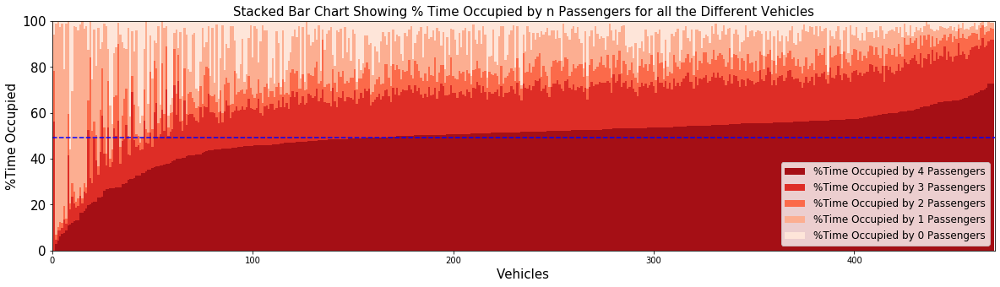

# Data Visualization Final Challenge Submission
### Author: Shivam Kumar Pathak (skp454)

### Q1: What is the serving rate for each scenario throughout the day, comparing to the overall serving rate? Serving rate is the number of successfully matched trip in a period of time. For example, is the serving rate higher in the rush hour or at night?

### Answer:
In the above plot, the red solid line shows the serving rate at different hours of the day, and the blue dashed line shows the average/overall serving rate. From this plot it is clearly observable, from 5AM to 12PM and 3PM to 10PM, the serving rate is higher than the average. These hours of the day corresponds to the Rush/Office hours, and using this plot it can be concluded that the serving rate is high during these times.

### Q2: For those trips that could not be served, do they follow a spatial or temporal pattern? For example, are most of those trips originated in particular regions, and of certain times?

### Answer:
The above heatmap shows the spatial distribution of non-served trip requests across different hours of the day. From the map, it can be clearly observed that the epicentres of the unfilled requests shifts throughout the day. During the morning hours, the number of unfulfilled request is high in lower Manhattan, during the day and evening time it shifts to midtown, and again during the night it shifts back to lower Manhattan. The map is helpful in understanding the spatio-temporal distribution of the unserved requests. 

### Q5: What can we learn about the vehicle utilization? Are most of them empty, or with 1, 2, 3 or 4 passengers? Are there particular vehicles that tend to ride with more passengers than others? If so, how are they distributed in space and time.

### Answer:

The above plot shows the stacked bar chart for percentage vehicle time it is occupied by different number of passengers. The plot contains bars for all the vehicles present in the dataset and is aranged to present information neatly. The blue line shows the mean of % time vehicles are occupied with 4 passenger. The plot clearly reflects that the distribution of high number of passengers(4) is homogenous across vehicles. For most of the vehicles the % time occupied by 4 passengers is close to the mean, and overall there is a very small standard deviation. However, There are certain vehicles which are mostly occupied by less number of passengers. To better understand the spatial temporal distribution of these cabs we plot the next map which is shown below. 

The above map shows the positions of vehicles at different time of the day, and the color reflects the number of passengers they are carrying. It can be clearly observed from the map that in certain hours of the day i.e., from 12 AM to 4 AM, the number of cabs carrying high number of passengers is low across all regions. In certain regions like upper Manhattan, most of the vehicles have low passengers throughout the day. We can clearly observe that most of the vehicles in lower and midtown Manhattan have high number of passengers. Also vehicles with high number of passengers peak during the rush hours.

Overall the above two plots helps us to effectively unearth insights related to vehicle utilization present in our data.

